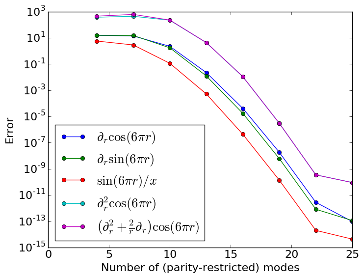

wavetoy-parity-Chebyshev
==================================================

A wave equation solver in spherical symmetry that demonstrates
the use of parity-limited Chebyshev polynomials

# Authors 

* Jonah Miller (jonah.maxwell.miller@gmail.com)

# Detailed Description

Spectral methods are a highly efficient approach to solving partial
differential equations because (for smooth problems), the error
converges exponentially. This repo demonstrates how to use a
particular family of spectral methods, parity-limited
Chebyshev-pseudospectral methods, to solve problems in spherical
symmetry, where there is a coordinate singularity at the origin. In a
Chebyshev-pseudospectral method, functions are assumed to be
*interpolating polynomials* which interpolate known values at known
locations, called *colocation points.*

The secret to handling the origin is that the coordinate singularity
can be resolved if one knows the *symmetry properties* of functions
about the origin, *r=0*. Therefore, we split our Chebyshev polynomials
into two families: the *odd-parity* and *even-parity*
families. Functions can be represented by either family, but not
both. Then differential operators map functions between the
families. For example, differentiating an odd-parity function makes it
even, and vice versa. By writing the Poisosn operator (which has a
coordinate singularity) in this way, the singularity can be
resolved. Here are the errors of different differential operators as a
function of the number of modes per family:

